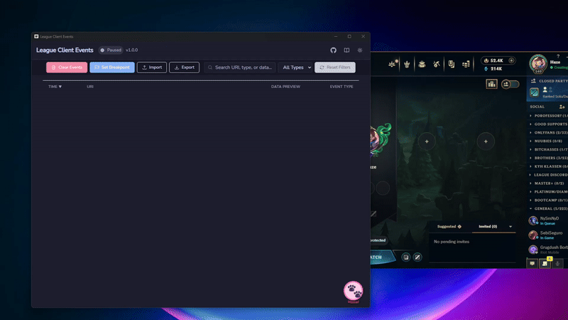

<div align="center">
  
  <h1>LCU Events</h1>
  <p>
    <strong>A powerful desktop application for real-time League Client event monitoring</strong>
  </p>
  
  <p>
    <a href="#features">Features</a> •
    <a href="#demo">Demo</a> •
    <a href="#installation">Installation</a> •
    <a href="#development">Development</a>
  </p>
</div>

## 🎯 Overview

LCU Events is a high-performance desktop application that provides real-time monitoring and debugging capabilities for the League of Legends Client. Built with modern technologies including Wails, React, TypeScript, and Go, it offers a seamless experience for developers and enthusiasts alike.

## ✨ Features

<div align="center">
  
</div>

### Core Capabilities
- 🔌 **Real-time Event Monitoring**: WebSocket-based event subscription to the League Client API
- 🔍 **Advanced Filtering**: Powerful event filtering and processing pipeline
- 🔄 **Reliable Connection**: Automatic reconnection with exponential backoff
- 🛡️ **Type Safety**: Full TypeScript integration for robust event handling
- ⚡ **Performance**: Efficient Go backend with minimal memory footprint
- 🎨 **Modern UI**: Responsive React frontend with TailwindCSS
- 🔄 **Auto Updates**: Seamless version checking and updates

## 🛠️ Tech Stack

### Frontend
    

- React 18+ with TypeScript
- TailwindCSS for modern styling
- React Query for efficient state management
- WebSocket event handling
- Responsive design with CSS Grid/Flexbox

### Backend
    

- Go 1.18+ for high performance
- [LCU-gopher](https://github.com/its-haze/lcu-gopher) for LCU API integration
- WebSocket event subscription with automatic reconnection
- Event filtering and processing pipeline
- Concurrent event handling with goroutines
- Comprehensive error handling and logging

## 📥 Installation

### Windows

1. Download the latest release
2. Run the installer
3. Launch from Start Menu or Desktop shortcut

## 🚀 Development

### Prerequisites
   

- Go 1.18+
- Node.js 16+
- NSIS (for Windows installer)
- Wails CLI

### Quick Start
```bash
# Clone the repository
git clone https://github.com/its-haze/lcu-events.git
cd lcu-events

# Install dependencies
cd frontend && npm install && cd ..

# Start development
wails dev
```

### Building

#### Windows
```bash
# Build the application
wails build -platform windows/amd64

# Build with installer
wails build -platform windows/amd64 -nsis
```

#### Development Build
```bash
# Start development server
wails dev

# Build development version
wails build -debug
```

## 📝 License

This project is licensed under the MIT License - see the [LICENSE](LICENSE) file for details.

## 🤝 Contributing

Contributions are welcome! Please feel free to submit a Pull Request. For major changes, please open an issue first to discuss what you would like to change.

1. Fork the repository
2. Create your feature branch (`git checkout -b feature/amazing-feature`)
3. Commit your changes (`git commit -m 'Add some amazing feature'`)
4. Push to the branch (`git push origin feature/amazing-feature`)
5. Open a Pull Request


## 🐛 Known Issues

- None at the moment

## 📞 Support

If you encounter any issues or have questions, please:

1. Search [existing issues](https://github.com/its-haze/lcu-events/issues)
2. Create a new issue if needed

## 🙏 Acknowledgments

- [Wails](https://wails.io/) for the amazing framework
- [LCU-gopher](https://github.com/its-haze/lcu-gopher) for LCU API integration
- All contributors and users of the project
